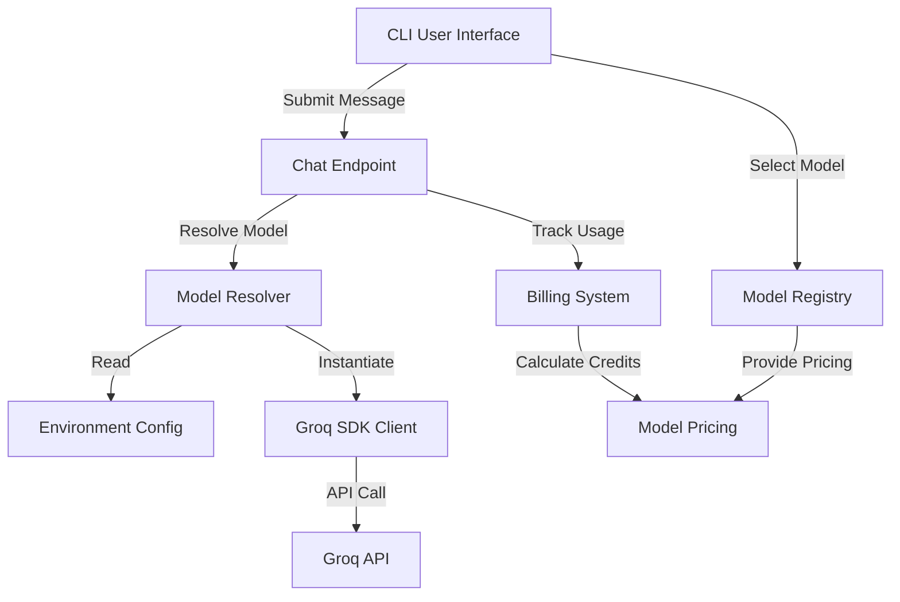

# Design Document: Groq LLM Provider Integration

## Overview

This design document specifies the technical approach for integrating Groq as a new LLM provider in the CheapCode CLI chat application. The integration follows the established pattern used for existing providers (Anthropic, OpenAI, Ollama) and maintains consistency across the model registry, model resolution, API key configuration, and billing systems.

### Design Goals

1. **Consistency**: Follow the existing provider integration pattern to ensure maintainability
2. **Minimal Changes**: Extend existing abstractions without modifying core infrastructure
3. **Type Safety**: Leverage TypeScript's type system to prevent configuration errors
4. **Testability**: Enable easy validation of Groq model availability and behavior
5. **User Experience**: Provide seamless Groq model selection and usage in the CLI

### Integration Points

The Groq provider integration touches the following subsystems:

- **Model Registry** (`@localcode/shared`): Add Groq as a supported provider and define available models
- **Model Resolution** (`@localcode/server`): Extend the model resolver to instantiate Groq clients
- **Environment Configuration**: Add `GROQ_API_KEY` to environment variables
- **Billing System**: Ensure Groq usage is tracked and billed correctly
- **Dependencies**: Add `@ai-sdk/groq` SDK to the server package

## Architecture

### High-Level Architecture



### Component Interaction Flow

1. **Model Selection**: User selects a Groq model from the Model Dialog UI
2. **Model Registry Lookup**: The selected model ID is validated against the Model Registry
3. **Model Resolution**: The Model Resolver instantiates a Groq client using the API key from environment config
4. **API Communication**: The Groq SDK client communicates with Groq's API
5. **Usage Tracking**: Token usage is tracked and converted to credits using the model's pricing information
6. **Billing Ingestion**: Usage credits are ingested into the Polar billing system

## Components and Interfaces

### 1. Model Registry Extension

**Location**: `packages/shared/src/models.ts`

**Changes Required**:

```typescript
// Add "groq" to the SupportedProvider union type
export type SupportedProvider = "anthropic" | "openai" | "ollama" | "groq";

// Add Groq model definitions to SUPPORTED_CHAT_MODELS array
const GROQ_MODELS = [
  {
    id: "llama-3.3-70b-versatile",
    provider: "groq",
    pricing: {
      inputUsdPerMillionTokens: 0.59,
      outputUsdPerMillionTokens: 0.79,
    },
  },
  {
    id: "llama-3.1-8b-instant",
    provider: "groq",
    pricing: {
      inputUsdPerMillionTokens: 0.05,
      outputUsdPerMillionTokens: 0.08,
    },
  },
  {
    id: "mixtral-8x7b-32768",
    provider: "groq",
    pricing: {
      inputUsdPerMillionTokens: 0.24,
      outputUsdPerMillionTokens: 0.24,
    },
  },
] as const satisfies readonly SupportedChatModelDefinition[];
```

**Design Rationale**:
- Groq models are defined with accurate pricing from Groq's official pricing page
- Model IDs match Groq's exact API identifiers to avoid mapping errors
- Pricing structure follows the existing pattern (input/output tokens per million)

### 2. Model Resolver Extension

**Location**: `packages/server/src/lib/models.ts`

**Changes Required**:

```typescript
import { createGroq } from "@ai-sdk/groq";

// Initialize Groq client with API key from environment
const groq = createGroq({
  apiKey: process.env.GROQ_API_KEY,
});

// Type alias for Groq model IDs
type GroqModelId = Extract<SupportedChatModel, { provider: "groq" }>["id"];

// Groq model resolver function
function resolveGroqModel(modelId: GroqModelId): ResolvedModel {
  return {
    model: groq(modelId),
    provider: "groq",
    modelId,
  };
}

// Extend the switch statement in resolveSupportedChatModel
function resolveSupportedChatModel(model: SupportedChatModel): ResolvedModel {
  const provider = model.provider;

  switch (provider) {
    case "anthropic":
      return resolveAnthropicModel(model.id);
    case "openai":
      return resolveOpenAIModel(model.id);
    case "ollama":
      return resolveOllamaModel(model.id);
    case "groq":
      return resolveGroqModel(model.id);
    default:
      return assertUnsupportedProvider(provider);
  }
}
```

**Design Rationale**:
- Groq client initialization follows the same pattern as Anthropic and OpenAI
- The `resolveGroqModel` function maintains consistency with existing resolver functions
- Type-safe model ID extraction ensures only valid Groq models are resolved
- No provider options are needed initially (can be added later if required)

### 3. Environment Configuration

**Location**: `.env.example`

**Changes Required**:

```bash
# Cloud AI Provider API Keys (optional - Ollama can be used instead)
ANTHROPIC_API_KEY=
OPENAI_API_KEY=
GROQ_API_KEY=
```

**Design Rationale**:
- Follows the existing pattern for provider API keys
- Placed alongside other cloud provider keys for consistency
- Optional like other cloud providers (Ollama can still be used without it)

### 4. Dependency Management

**Location**: `packages/server/package.json`

**Changes Required**:

```json
{
  "dependencies": {
    "@ai-sdk/anthropic": "^3.0.68",
    "@ai-sdk/groq": "^1.0.14",
    "@ai-sdk/openai": "^3.0.52",
    // ... other dependencies
  }
}
```

**Design Rationale**:
- Uses the official Vercel AI SDK integration for Groq
- Ensures compatibility with the existing `ai` package ecosystem
- Follows semantic versioning for future updates

## Correctness Properties

*A property is a characteristic or behavior that should hold true across all valid executions of a system—essentially, a formal statement about what the system should do. Properties serve as the bridge between human-readable specifications and machine-verifiable correctness guarantees.*

### Property 1: Model Resolution Provider Field

*For any* Groq model ID in the Model Registry, when resolved by the Model Resolver, the returned ResolvedModel SHALL have the provider field set to "groq".

**Validates: Requirements 4.4**

### Property 2: Credits Calculation Correctness

*For any* Groq model in the Model Registry and any valid token usage (non-negative integer prompt tokens and completion tokens), the calculated credits SHALL equal:
```
max(1, ceil((promptTokens × inputUsdPerMillionTokens + completionTokens × outputUsdPerMillionTokens) / 1_000_000 / 0.01))
```
where pricing values come from the Groq model's pricing definition in the Model Registry.

**Validates: Requirements 6.1, 6.2**

### Property 3: Formula Consistency Across Providers

*For any* model from any provider (Anthropic, OpenAI, Ollama, or Groq) and any valid token usage, the credit calculation formula SHALL be identical, differing only in the pricing values specific to each model.

**Validates: Requirements 6.3**

### Property 4: Billing Metadata Completeness

*For any* Groq usage event ingested into the billing system, the billing record SHALL include a provider field with value "groq" and a model field containing the exact Groq model ID that was used.

**Validates: Requirements 6.4**

### Property 5: Model Validation Correctness

*For any* model ID string (valid or invalid, from any provider), the model validation logic SHALL:
- Return true (or pass validation) if and only if the model ID exists in the Model Registry
- Throw an error with message "Unsupported model: {modelId}" if and only if the model ID does not exist in the Model Registry
- Apply the same validation logic regardless of which provider the model belongs to

**Validates: Requirements 7.1, 7.2, 7.3, 7.4**

## Data Models

### SupportedProvider Type

```typescript
export type SupportedProvider = "anthropic" | "openai" | "ollama" | "groq";
```

**Purpose**: Union type that defines all supported LLM providers in the system.

### GroqModelId Type

```typescript
type GroqModelId = Extract<SupportedChatModel, { provider: "groq" }>["id"];
```

**Purpose**: Type-safe extraction of Groq model IDs from the model registry.

### ModelPricing Interface

```typescript
export type ModelPricing = {
  inputUsdPerMillionTokens: number;
  outputUsdPerMillionTokens: number;
};
```

**Purpose**: Defines the pricing structure for all models including Groq.

### ResolvedModel Type

```typescript
export type ResolvedModel = {
  model: LanguageModel;
  provider: SupportedProvider;
  modelId: SupportedChatModelId;
  providerOptions?: ProviderOptions;
};
```

**Purpose**: Represents a fully resolved model ready for API calls.

### Groq Model Definitions

```typescript
const GROQ_MODELS = [
  {
    id: "llama-3.3-70b-versatile",
    provider: "groq",
    pricing: {
      inputUsdPerMillionTokens: 0.59,
      outputUsdPerMillionTokens: 0.79,
    },
  },
  {
    id: "llama-3.1-8b-instant",
    provider: "groq",
    pricing: {
      inputUsdPerMillionTokens: 0.05,
      outputUsdPerMillionTokens: 0.08,
    },
  },
  {
    id: "mixtral-8x7b-32768",
    provider: "groq",
    pricing: {
      inputUsdPerMillionTokens: 0.24,
      outputUsdPerMillionTokens: 0.24,
    },
  },
] as const satisfies readonly SupportedChatModelDefinition[];
```

**Data Integrity**:
- Pricing values are sourced from Groq's official pricing documentation
- Model IDs match Groq's API specification exactly
- The `as const satisfies` pattern ensures type safety and immutability

## Error Handling

### API Key Missing

**Scenario**: User attempts to use a Groq model without configuring `GROQ_API_KEY`.

**Handling**:
- The `@ai-sdk/groq` SDK will throw an error when attempting to initialize without an API key
- Error should propagate to the chat endpoint and be returned as a user-facing error message
- Suggested error message: "Groq API key not configured. Please set GROQ_API_KEY in your .env file."

**Implementation Location**: `packages/server/src/lib/models.ts` (Groq client initialization)

### Invalid Model ID

**Scenario**: User or system provides a Groq model ID that doesn't exist in the Model Registry.

**Handling**:
- The `resolveChatModel` function already handles this case
- Throws error: `Unsupported model: {modelId}`
- Error is caught in the chat endpoint and returned as HTTP 400 Bad Request

**Implementation Location**: `packages/server/src/lib/models.ts` (`resolveChatModel` function)

### API Rate Limiting

**Scenario**: Groq API returns a 429 Too Many Requests error.

**Handling**:
- The `@ai-sdk/groq` SDK will throw an error with rate limit information
- Error should be caught in the chat endpoint and returned with appropriate message
- Suggested error message: "Groq rate limit exceeded. Please try again in a few moments."

**Implementation Location**: `packages/server/src/routes/conversations.ts` (chat endpoint error handling)

### Network Errors

**Scenario**: Network issues prevent communication with Groq API.

**Handling**:
- SDK will throw network-related errors
- Chat endpoint should catch and return user-friendly error messages
- Suggested error message: "Unable to connect to Groq API. Please check your network connection."

**Implementation Location**: `packages/server/src/routes/conversations.ts`

### Model Unavailability

**Scenario**: Groq temporarily disables a model or changes its availability.

**Handling**:
- Groq API will return an error indicating model unavailability
- Error should be surfaced to the user with the specific model name
- Suggested error message: "Model {modelId} is currently unavailable. Please try a different model."

**Implementation Location**: `packages/server/src/routes/conversations.ts`

## Testing Strategy

### Dual Testing Approach

This feature requires both **unit tests** and **property-based tests** to ensure comprehensive correctness:

- **Unit tests**: Verify specific examples, integration points, and configuration
- **Property tests**: Verify universal properties across all valid inputs

### Property-Based Tests

**Framework**: Use `fast-check` for TypeScript property-based testing (or the appropriate library for the project's test framework)

**Configuration**: Each property test MUST run a minimum of 100 iterations

**Test Implementation**:

1. **Property 1: Model Resolution Provider Field**
   ```typescript
   // Feature: groq-llm-provider, Property 1: For any Groq model ID in the Model Registry, resolved provider is "groq"
   
   test("resolving any Groq model sets provider to groq", () => {
     fc.assert(
       fc.property(
         fc.constantFrom(...GROQ_MODEL_IDS),
         (modelId) => {
           const resolved = resolveChatModel(modelId);
           expect(resolved.provider).toBe("groq");
         }
       ),
       { numRuns: 100 }
     );
   });
   ```

2. **Property 2: Credits Calculation Correctness**
   ```typescript
   // Feature: groq-llm-provider, Property 2: Credits calculation uses correct formula for any Groq model and token counts
   
   test("credits calculated correctly for any Groq model and token counts", () => {
     fc.assert(
       fc.property(
         fc.constantFrom(...GROQ_MODEL_IDS),
         fc.nat(1000000), // promptTokens
         fc.nat(1000000), // completionTokens
         (modelId, promptTokens, completionTokens) => {
           const model = findSupportedChatModel(modelId);
           const usage = { promptTokens, completionTokens, totalTokens: promptTokens + completionTokens };
           const result = calculateCreditsForUsage({ provider: "groq", model: modelId, usage });
           
           const expectedCostUsd = 
             (promptTokens * model.pricing.inputUsdPerMillionTokens + 
              completionTokens * model.pricing.outputUsdPerMillionTokens) / 1_000_000;
           const expectedCredits = Math.max(1, Math.ceil(expectedCostUsd / 0.01));
           
           expect(result.credits).toBe(expectedCredits);
         }
       ),
       { numRuns: 100 }
     );
   });
   ```

3. **Property 3: Formula Consistency Across Providers**
   ```typescript
   // Feature: groq-llm-provider, Property 3: Credit calculation formula is consistent across all providers
   
   test("credit formula consistent for any provider and token counts", () => {
     fc.assert(
       fc.property(
         fc.constantFrom(...ALL_MODEL_IDS), // All providers
         fc.nat(1000000),
         fc.nat(1000000),
         (modelId, promptTokens, completionTokens) => {
           const model = findSupportedChatModel(modelId);
           const usage = { promptTokens, completionTokens, totalTokens: promptTokens + completionTokens };
           const result = calculateCreditsForUsage({ 
             provider: model.provider, 
             model: modelId, 
             usage 
           });
           
           // Verify formula structure is consistent
           const costUsd = 
             (promptTokens * model.pricing.inputUsdPerMillionTokens + 
              completionTokens * model.pricing.outputUsdPerMillionTokens) / 1_000_000;
           const expectedCredits = Math.max(1, Math.ceil(costUsd / 0.01));
           
           expect(result.credits).toBe(expectedCredits);
         }
       ),
       { numRuns: 100 }
     );
   });
   ```

4. **Property 4: Billing Metadata Completeness**
   ```typescript
   // Feature: groq-llm-provider, Property 4: Billing records include correct provider and model for any Groq usage
   
   test("billing metadata includes groq provider and correct model", () => {
     fc.assert(
       fc.property(
         fc.constantFrom(...GROQ_MODEL_IDS),
         fc.nat(1000),
         fc.nat(1000),
         async (modelId, promptTokens, completionTokens) => {
           // Mock billing ingestion to capture the record
           const billingRecords = [];
           const mockIngestAiUsage = (record) => billingRecords.push(record);
           
           // Simulate usage event
           const usage = { promptTokens, completionTokens, totalTokens: promptTokens + completionTokens };
           await simulateGroqUsage(modelId, usage, mockIngestAiUsage);
           
           // Verify billing record metadata
           expect(billingRecords).toHaveLength(1);
           expect(billingRecords[0].metadata).toMatchObject({
             provider: "groq",
             model: modelId
           });
         }
       ),
       { numRuns: 100 }
     );
   });
   ```

5. **Property 5: Model Validation Correctness**
   ```typescript
   // Feature: groq-llm-provider, Property 5: Model validation works correctly for any model ID from any provider
   
   test("model validation correctly identifies valid and invalid models", () => {
     fc.assert(
       fc.property(
         fc.oneof(
           fc.constantFrom(...ALL_MODEL_IDS), // Valid models
           fc.string().filter(id => !ALL_MODEL_IDS.includes(id)) // Invalid models
         ),
         (modelId) => {
           const isValid = ALL_MODEL_IDS.includes(modelId);
           
           if (isValid) {
             expect(() => resolveChatModel(modelId)).not.toThrow();
             expect(isSupportedChatModel(modelId)).toBe(true);
           } else {
             expect(() => resolveChatModel(modelId)).toThrow(`Unsupported model: ${modelId}`);
             expect(isSupportedChatModel(modelId)).toBe(false);
           }
         }
       ),
       { numRuns: 100 }
     );
   });
   ```

### Unit Tests

**Test Coverage Areas**:

1. **Model Registry Validation**
   - Test that all Groq models have valid pricing information (specific check)
   - Test that Groq model IDs are unique within the registry
   - Test that `findSupportedChatModel` returns correct Groq models for specific IDs

2. **Model Resolution Integration**
   - Test that `resolveGroqModel` returns correct ResolvedModel structure for specific model
   - Test that Groq client is initialized with correct API key from environment
   - Test error handling when GROQ_API_KEY is missing

3. **Configuration and Setup**
   - Test that GROQ_API_KEY is read from environment correctly
   - Test that .env.example documents GROQ_API_KEY
   - Test that Groq SDK dependency is installed

4. **Type Safety**
   - Test that TypeScript compiler enforces valid provider types
   - Test that model ID extraction works correctly for Groq

**Example Unit Test**:

```typescript
describe("Groq Model Resolution", () => {
  it("should resolve llama-3.3-70b-versatile correctly", () => {
    const resolved = resolveChatModel("llama-3.3-70b-versatile");
    expect(resolved.provider).toBe("groq");
    expect(resolved.modelId).toBe("llama-3.3-70b-versatile");
    expect(resolved.model).toBeDefined();
  });

  it("should throw error for unsupported Groq model", () => {
    expect(() => resolveChatModel("groq-invalid-model")).toThrow("Unsupported model");
  });
  
  it("should read GROQ_API_KEY from environment", () => {
    process.env.GROQ_API_KEY = "test-key";
    // Verify client initialization uses the key
    expect(groqClient).toBeDefined();
  });
});
```

### Integration Tests

**Test Coverage Areas**:

1. **End-to-End Chat Flow**
   - Test complete chat message flow with Groq models
   - Test streaming responses from Groq API
   - Test usage tracking and credit calculation
   - Test billing ingestion for Groq usage

2. **API Key Configuration**
   - Test behavior when GROQ_API_KEY is set correctly
   - Test error handling when GROQ_API_KEY is missing
   - Test error handling when GROQ_API_KEY is invalid

3. **Model Selection**
   - Test that Groq models appear in model selection UI
   - Test that selected Groq model is used for chat
   - Test switching between Groq and other providers

**Example Integration Test**:

```typescript
describe("Groq Chat Integration", () => {
  it("should complete a chat message with Groq model", async () => {
    const response = await chatEndpoint({
      model: "llama-3.1-8b-instant",
      messages: [{ role: "user", content: "Hello" }],
    });

    expect(response.status).toBe(200);
    expect(response.body).toContain("stream");
  });
});
```

### Manual Testing Checklist

- [ ] Groq API key can be configured in .env file
- [ ] Groq models appear in model selection dialog
- [ ] Chat messages work with llama-3.3-70b-versatile
- [ ] Chat messages work with llama-3.1-8b-instant
- [ ] Chat messages work with mixtral-8x7b-32768
- [ ] Usage is tracked correctly for Groq models
- [ ] Credits are calculated and ingested for Groq usage
- [ ] Error messages are clear when API key is missing
- [ ] Error messages are clear when rate limited
- [ ] Switching between Groq and other providers works seamlessly

## Implementation Approach

### Phase 1: Foundation (Dependencies and Types)

**Tasks**:
1. Add `@ai-sdk/groq` dependency to `packages/server/package.json`
2. Run `bun install` to install the new dependency
3. Update `SupportedProvider` type in `packages/shared/src/models.ts`
4. Add `GROQ_API_KEY` to `.env.example`

**Validation**: TypeScript compiles without errors after type changes.

### Phase 2: Model Registry

**Tasks**:
1. Add Groq model definitions to `SUPPORTED_CHAT_MODELS` array
2. Verify pricing information matches Groq's official pricing
3. Ensure model IDs match Groq's API specification

**Validation**: Run `findSupportedChatModel` for each Groq model and verify correct results.

### Phase 3: Model Resolution

**Tasks**:
1. Import `createGroq` from `@ai-sdk/groq` in `models.ts`
2. Initialize Groq client with `GROQ_API_KEY`
3. Implement `resolveGroqModel` function
4. Add "groq" case to `resolveSupportedChatModel` switch statement

**Validation**: Call `resolveChatModel` with Groq model IDs and verify ResolvedModel structure.

### Phase 4: Integration Testing

**Tasks**:
1. Set `GROQ_API_KEY` in local `.env` file
2. Start the development server
3. Open CLI and select a Groq model
4. Submit test chat messages
5. Verify responses stream correctly
6. Check database for usage records
7. Verify credits are calculated correctly

**Validation**: Complete chat conversation works end-to-end with Groq models.

### Phase 5: Error Handling and Edge Cases

**Tasks**:
1. Test behavior without `GROQ_API_KEY` set
2. Test with invalid API key
3. Test rate limiting scenarios
4. Test network failure scenarios
5. Test with very long input/output

**Validation**: All error scenarios produce clear, user-friendly error messages.

### Phase 6: Documentation

**Tasks**:
1. Update README with Groq provider information
2. Document Groq API key setup process
3. Document available Groq models and their characteristics
4. Add Groq to provider comparison documentation

**Validation**: Documentation is clear and complete for end users.

## Implementation Dependencies

### External Dependencies

- `@ai-sdk/groq@^1.0.14`: Official Vercel AI SDK integration for Groq
- Valid Groq API key for testing and development

### Internal Dependencies

- `@localcode/shared`: Model registry and type definitions
- `@localcode/server`: Model resolution and chat endpoint
- `ai` package: Core streaming and language model abstractions

### No Breaking Changes

This design does not introduce breaking changes:
- Existing providers continue to work unchanged
- Model registry is extended, not modified
- Environment variables are additive (optional)
- Billing system handles Groq automatically through existing abstractions

## Deployment Considerations

### Environment Variables

**Production**:
- `GROQ_API_KEY` must be set in production environment
- API key should be stored securely (e.g., in secrets manager)
- API key should be scoped appropriately (not a personal key)

**Development**:
- Developers can use personal Groq API keys
- Keys should not be committed to version control
- `.env.example` should document the variable clearly

### Rollout Strategy

1. **Internal Testing**: Test with development Groq API keys
2. **Beta Release**: Enable for subset of users with opt-in
3. **Full Release**: Enable for all users after validation
4. **Monitoring**: Track Groq API error rates and usage patterns

### Monitoring

**Key Metrics**:
- Groq API error rate (overall and by error type)
- Groq model usage distribution
- Average response time for Groq models
- Credit consumption for Groq vs other providers
- User adoption rate of Groq models

**Alerts**:
- Alert on Groq API error rate > 5%
- Alert on rate limiting issues
- Alert on billing ingestion failures for Groq usage

## Future Enhancements

### Provider Options

Groq may support advanced features in the future:
- Custom reasoning budgets
- Extended thinking modes
- Fine-tuned model support

**Design**: Add `GROQ_PROVIDER_OPTIONS` similar to `ANTHROPIC_PROVIDER_OPTIONS` when needed.

### Additional Models

As Groq releases new models:
- Add model definitions to `GROQ_MODELS` array
- Update pricing information
- Update documentation

**Design**: Model registry is designed for easy extension.

### Model Capabilities

Future enhancements could include:
- Model capability metadata (context length, supported features)
- Model selection based on task requirements
- Cost optimization based on model capabilities

**Design**: Add optional `capabilities` field to model definitions.

## Security Considerations

### API Key Storage

- API keys are stored in environment variables (never in code)
- `.gitignore` ensures `.env` files are never committed
- Production keys should use secure secret management

### API Key Validation

- Invalid API keys should not expose internal error details
- Error messages should be user-friendly without leaking system information

### Rate Limiting

- Groq's rate limits should be respected
- Consider implementing client-side rate limiting if needed
- Monitor for abuse patterns

### Usage Tracking

- All Groq usage must be tracked for billing accuracy
- Usage records should be tamper-proof
- Failed billing ingestion should be logged and retried

## Conclusion

This design provides a comprehensive approach to integrating Groq as a new LLM provider in CheapCode. The integration follows established patterns, maintains type safety, and ensures seamless user experience. By extending existing abstractions rather than creating new ones, the implementation minimizes complexity and maintains system consistency.

The design prioritizes:
- **Consistency** with existing provider patterns
- **Type safety** through TypeScript
- **Testability** at unit and integration levels
- **User experience** with clear error messages
- **Billing accuracy** through existing credit calculation
- **Security** through proper API key management

Implementation can proceed incrementally through the defined phases, with validation at each step ensuring quality and correctness.
