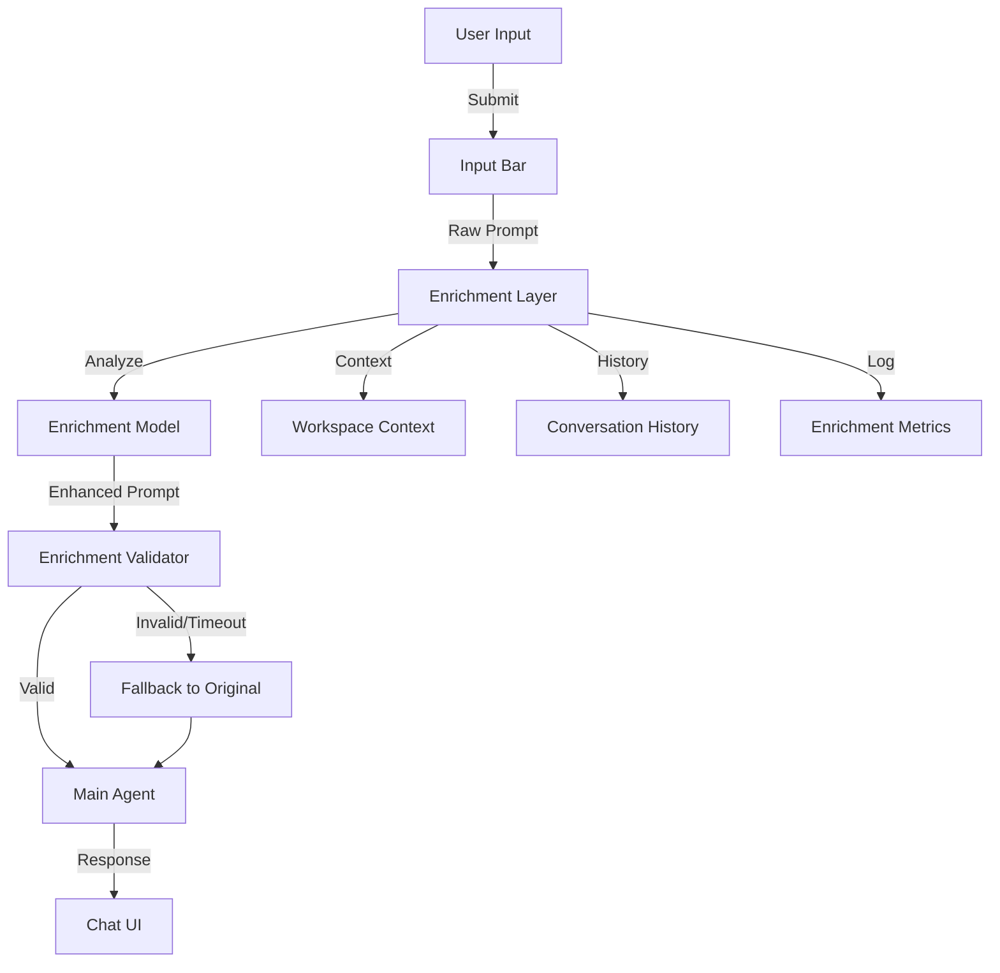

# Design Document: Prompt Enrichment Layer

## Overview

This design document specifies the technical approach for implementing a Prompt Enrichment Layer in the CheapCode CLI application. The enrichment layer acts as a preprocessing component that analyzes and enhances user prompts before they reach the main LLM agent, improving comprehension and response quality.

### Design Goals

1. **Improved Intent Understanding**: Expand brief or vague user prompts with context and clarifications
2. **Context-Aware Enhancement**: Leverage workspace information and conversation history for relevant enrichment
3. **Configurable Models**: Allow users to select different models for enrichment vs. main processing
4. **Minimal Latency**: Complete enrichment within 3-5 seconds to maintain user flow
5. **Graceful Degradation**: Continue functioning even when enrichment fails or is unavailable
6. **Transparency**: Allow users to see and understand what enrichment occurred

### Integration Points

The Prompt Enrichment Layer touches the following subsystems:

- **Chat Flow** (`packages/cli/src/hooks/use-chat.ts`): Intercept user prompts before submission
- **API Endpoint** (`packages/server/src/routes/conversations.ts`): Add enrichment preprocessing
- **Model Resolution** (`packages/server/src/lib/models.ts`): Support separate enrichment model configuration
- **System Prompts** (`packages/server/src/system-prompt.ts`): Create enrichment-specific prompts
- **Configuration**: Add enrichment model and timeout settings

## Architecture

### High-Level Architecture



### Component Interaction Flow

1. **User Submission**: User submits a prompt through the input bar
2. **Enrichment Request**: Chat hook sends prompt to enrichment endpoint
3. **Context Gathering**: Enrichment layer gathers workspace and conversation context
4. **Model Processing**: Enrichment model analyzes and enhances the prompt
5. **Validation**: System validates enriched prompt for quality and safety
6. **Fallback**: If enrichment fails/times out, use original prompt
7. **Main Processing**: Enhanced (or original) prompt is sent to main agent
8. **Response**: Main agent processes and responds to enriched prompt

## Components and Interfaces

### 1. Enrichment Service

**Location**: `packages/server/src/lib/enrichment.ts` (new file)

**Purpose**: Core service responsible for prompt enrichment logic.

**Interface**:

```typescript
export type EnrichmentOptions = {
  userPrompt: string;
  mode: ModeType;
  workspaceContext?: WorkspaceContext;
  conversationHistory?: ConversationMessage[];
  enrichmentModel?: SupportedChatModelId;
  timeoutMs?: number;
};

export type EnrichmentResult = {
  enrichedPrompt: string;
  wasEnriched: boolean;
  enrichmentApplied: string[];  // List of enrichment types applied
  tokensUsed?: number;
  durationMs: number;
  model?: string;
};

export type EnrichmentError = {
  error: string;
  originalPrompt: string;
  fallbackUsed: true;
};

export async function enrichPrompt(
  options: EnrichmentOptions
): Promise<EnrichmentResult | EnrichmentError>;
```

**Design Rationale**:
- Accepts all necessary context for enrichment (prompt, mode, workspace, history)
- Returns structured result with metadata for transparency
- Includes error handling with automatic fallback to original prompt
- Tracks metrics (tokens, duration) for monitoring

### 2. Enrichment Endpoint

**Location**: `packages/server/src/routes/enrichment.ts` (new file)

**Purpose**: HTTP endpoint for enrichment requests from the client.

**Interface**:

```typescript
POST /api/v1/enrichment/analyze

Request Body:
{
  userPrompt: string;
  mode: ModeType;
  workspaceId: string;
  enrichmentModel?: SupportedChatModelId;
  includeHistory?: boolean;
  groqApiKey?: string;
}

Response:
{
  enrichedPrompt: string;
  wasEnriched: boolean;
  enrichmentApplied: string[];
  tokensUsed?: number;
  durationMs: number;
}
```

**Design Rationale**:
- Separate endpoint from main chat for isolated testing and monitoring
- Accepts workspace ID to retrieve context server-side (avoids large payloads)
- Optional history inclusion to balance context vs. performance
- Supports custom enrichment models per request
- Returns enrichment metadata for transparency

### 3. Enrichment Strategies

**Location**: `packages/server/src/lib/enrichment-strategies.ts` (new file)

**Purpose**: Classify prompts and apply appropriate enrichment strategies.

**Interface**:

```typescript
export type PromptIntent = 
  | "question"
  | "implementation"
  | "debug"
  | "analysis"
  | "already_detailed";

export type EnrichmentStrategy = {
  intent: PromptIntent;
  shouldEnrich: boolean;
  enrichmentInstructions: string;
};

export function classifyPromptIntent(
  prompt: string,
  mode: ModeType
): PromptIntent;

export function getEnrichmentStrategy(
  intent: PromptIntent,
  mode: ModeType
): EnrichmentStrategy;
```

**Design Rationale**:
- Classifies prompts before enriching to apply appropriate strategy
- Different strategies for questions vs. implementations vs. debugging
- "already_detailed" bypass for prompts that don't need enrichment
- Mode-aware strategies (PLAN vs. BUILD)

### 4. Workspace Context Extractor

**Location**: `packages/server/src/lib/workspace-context.ts` (new file)

**Purpose**: Extract relevant workspace information for enrichment.

**Interface**:

```typescript
export type WorkspaceContext = {
  technologies: string[];  // e.g., ["React", "TypeScript", "Node.js"]
  fileStructureSummary: string;  // Brief overview of project structure
  recentFiles: string[];  // Recently accessed/modified files
  projectName?: string;
};

export async function getWorkspaceContext(
  workspaceId: string
): Promise<WorkspaceContext>;
```

**Design Rationale**:
- Provides focused context without sending entire file system
- Identifies technologies to help disambiguate technical terms
- Recent files help resolve references like "the config file"
- Lightweight extraction to minimize latency impact

### 5. Enrichment Prompt Builder

**Location**: `packages/server/src/lib/enrichment-prompts.ts` (new file)

**Purpose**: Build system prompts for the enrichment model.

**Interface**:

```typescript
export type EnrichmentPromptParams = {
  userPrompt: string;
  intent: PromptIntent;
  mode: ModeType;
  workspaceContext?: WorkspaceContext;
  conversationHistory?: ConversationMessage[];
};

export function buildEnrichmentPrompt(
  params: EnrichmentPromptParams
): string;
```

**Design Rationale**:
- Creates focused prompts for the enrichment model
- Includes relevant context without overwhelming the model
- Intent-specific instructions guide enrichment appropriately
- Mode-aware to suggest mode-appropriate actions

### 6. Enrichment Validator

**Location**: `packages/server/src/lib/enrichment-validator.ts` (new file)

**Purpose**: Validate enriched prompts before passing to main agent.

**Interface**:

```typescript
export type ValidationResult = {
  valid: boolean;
  reason?: string;
  sanitizedPrompt?: string;
};

export function validateEnrichedPrompt(
  originalPrompt: string,
  enrichedPrompt: string
): ValidationResult;
```

**Validation Rules**:
- Enriched prompt must not be > 3x the original length
- Must not contain hallucinated file paths (validated against workspace)
- Must preserve original user intent (no contradictions)
- Must not add false assumptions
- Must mask any detected API keys or secrets

**Design Rationale**:
- Safety check to prevent bad enrichments from reaching main agent
- Protects against hallucination and over-expansion
- Ensures enrichment improves rather than distorts user intent

### 7. Client Integration

**Location**: `packages/cli/src/hooks/use-chat.ts` (modification)

**Changes Required**:

```typescript
export function useChat(
  workspaceId: string,
  initialMessages: Message[],
  groqApiKey?: string | null
) {
  const [enrichmentEnabled, setEnrichmentEnabled] = useState(true);
  
  const enrichAndSubmit = async (params: {
    userText: string;
    mode: ModeType;
    model: SupportedChatModelId;
  }) => {
    if (!enrichmentEnabled) {
      return chat.sendMessage({
        text: params.userText,
        metadata: { mode: params.mode, model: params.model },
      });
    }
    
    try {
      const enrichmentResult = await apiClient.api.v1.enrichment.analyze.$post({
        json: {
          userPrompt: params.userText,
          mode: params.mode,
          workspaceId,
          groqApiKey,
        },
      });
      
      const data = await enrichmentResult.json();
      
      // Use enriched prompt if successful
      const finalText = data.wasEnriched ? data.enrichedPrompt : params.userText;
      
      return chat.sendMessage({
        text: finalText,
        metadata: {
          mode: params.mode,
          model: params.model,
          enrichmentApplied: data.wasEnriched ? data.enrichmentApplied : undefined,
        },
      });
    } catch (error) {
      // Fallback to original on error
      return chat.sendMessage({
        text: params.userText,
        metadata: { mode: params.mode, model: params.model },
      });
    }
  };
  
  return {
    ...chat,
    submit: enrichAndSubmit,
    enrichmentEnabled,
    toggleEnrichment: () => setEnrichmentEnabled(!enrichmentEnabled),
  };
}
```

**Design Rationale**:
- Enrichment happens before message submission
- Graceful fallback on errors
- User can toggle enrichment on/off
- Metadata tracks whether enrichment was applied

## Data Models

### EnrichmentOptions

```typescript
export type EnrichmentOptions = {
  userPrompt: string;                      // Original user input
  mode: ModeType;                           // PLAN or BUILD mode
  workspaceContext?: WorkspaceContext;     // Project context
  conversationHistory?: ConversationMessage[]; // Recent messages
  enrichmentModel?: SupportedChatModelId;  // Model to use for enrichment
  timeoutMs?: number;                       // Max enrichment time (default: 5000)
};
```

### EnrichmentResult

```typescript
export type EnrichmentResult = {
  enrichedPrompt: string;      // Enhanced version of prompt
  wasEnriched: boolean;        // Whether enrichment was applied
  enrichmentApplied: string[]; // Types of enrichment ["context", "clarification", "technical_details"]
  tokensUsed?: number;         // Tokens consumed by enrichment
  durationMs: number;          // Time taken for enrichment
  model?: string;              // Model used for enrichment
};
```

### WorkspaceContext

```typescript
export type WorkspaceContext = {
  technologies: string[];         // Detected tech stack
  fileStructureSummary: string;  // Brief project structure
  recentFiles: string[];         // Recently accessed files
  projectName?: string;          // Project name if detectable
};
```

### PromptIntent

```typescript
export type PromptIntent = 
  | "question"          // Asking for information or explanation
  | "implementation"    // Requesting code changes or new features
  | "debug"            // Reporting bugs or errors
  | "analysis"         // Requesting code analysis or review
  | "already_detailed"; // Prompt already has sufficient detail
```

### EnrichmentStrategy

```typescript
export type EnrichmentStrategy = {
  intent: PromptIntent;             // Classified intent
  shouldEnrich: boolean;            // Whether to apply enrichment
  enrichmentInstructions: string;   // Instructions for enrichment model
};
```

## Correctness Properties

*A property is a characteristic or behavior that should hold true across all valid executions of a system—essentially, a formal statement about what the system should do. Properties serve as the bridge between human-readable specifications and machine-verifiable correctness guarantees.*

### Property 1: Intent Preservation

*For any* user prompt and enriched version, the enriched prompt SHALL preserve the core intent and goals of the original prompt without introducing contradictions.

**Validates: Requirements 1.6**

### Property 2: Enrichment Timeout Compliance

*For any* user prompt under 500 characters, the enrichment process SHALL complete within 3 seconds OR timeout and return the original prompt.

**Validates: Requirements 5.1**

### Property 3: Fallback Consistency

*For any* enrichment error or timeout, the system SHALL return the original user prompt unmodified and allow the user to continue interacting with the main agent.

**Validates: Requirements 8.1, 8.3, 8.4**

### Property 4: Length Validation

*For any* enriched prompt that exceeds 3x the length of the original prompt, the validator SHALL reject it and fall back to the original prompt.

**Validates: Requirements 7.4**

### Property 5: Secret Masking

*For any* prompt containing patterns matching API keys or secrets, the enrichment layer SHALL mask them in logs and not transmit them to the enrichment model without explicit permission.

**Validates: Requirements 10.2**

### Property 6: Mode-Aware Enrichment

*For any* user prompt enriched in PLAN mode, the enriched prompt SHALL focus on analysis and exploration goals, and SHALL NOT suggest file modification actions.

**Validates: Requirements 6.1**

### Property 7: Mode-Aware Enrichment (BUILD)

*For any* user prompt enriched in BUILD mode, the enriched prompt SHALL focus on implementation and modification goals, and MAY suggest file operations.

**Validates: Requirements 6.2**

### Property 8: Workspace File Validation

*For any* enriched prompt containing file path references, those file paths SHALL either (a) exist in the workspace, or (b) be clearly marked as suggestions for new files.

**Validates: Requirements 2.5**

## Error Handling

### Enrichment Model Unavailable

**Scenario**: The configured enrichment model is unavailable or returns an error.

**Handling**:
- Log the error with details (model ID, error message)
- Return `EnrichmentError` with `fallbackUsed: true`
- Use original prompt for main agent
- Display subtle indicator to user that enrichment was skipped

**Implementation Location**: `packages/server/src/lib/enrichment.ts`

### Enrichment Timeout

**Scenario**: Enrichment takes longer than configured timeout (default 5s).

**Handling**:
- Abort the enrichment API call using AbortController
- Log timeout event with duration and prompt length
- Return original prompt immediately
- Track timeout metrics for monitoring

**Implementation Location**: `packages/server/src/lib/enrichment.ts`

**Code Pattern**:
```typescript
const controller = new AbortController();
const timeoutId = setTimeout(() => controller.abort(), timeoutMs);

try {
  const result = await enrichmentModel.generate({
    prompt: systemPrompt,
    signal: controller.signal,
  });
  clearTimeout(timeoutId);
  return result;
} catch (error) {
  if (error.name === 'AbortError') {
    return { error: 'Timeout', originalPrompt, fallbackUsed: true };
  }
  throw error;
}
```

### Invalid Enriched Output

**Scenario**: Enrichment model returns malformed or invalid output.

**Handling**:
- Validate structure of enriched prompt
- Check for required fields and sensible content
- If invalid, reject and use original prompt
- Log validation failure for review

**Validation Checks**:
- Non-empty string
- Contains actual text (not just whitespace)
- Reasonable length (not > 10x original)
- Valid UTF-8 encoding

**Implementation Location**: `packages/server/src/lib/enrichment-validator.ts`

### Consecutive Enrichment Failures

**Scenario**: Enrichment fails 3 times in a row.

**Handling**:
- Temporarily disable enrichment for the session
- Show toast notification: "Enrichment temporarily disabled due to repeated failures"
- Provide button to re-enable if user wants to try again
- Continue using original prompts
- Re-enable automatically on next session

**Implementation Location**: `packages/cli/src/hooks/use-chat.ts`

**State Management**:
```typescript
const [enrichmentFailures, setEnrichmentFailures] = useState(0);
const [enrichmentEnabled, setEnrichmentEnabled] = useState(true);

const handleEnrichmentFailure = () => {
  const newCount = enrichmentFailures + 1;
  setEnrichmentFailures(newCount);
  
  if (newCount >= 3) {
    setEnrichmentEnabled(false);
    toast.error("Enrichment temporarily disabled due to repeated failures");
  }
};

const handleEnrichmentSuccess = () => {
  setEnrichmentFailures(0);  // Reset on success
};
```

### API Key Not Configured

**Scenario**: Enrichment model requires API key that isn't configured.

**Handling**:
- Check for required API key during enrichment model initialization
- If missing, log warning and disable enrichment
- Show user-friendly message: "Enrichment unavailable: API key not configured"
- Fallback to original prompts automatically

**Implementation Location**: `packages/server/src/lib/enrichment.ts`

### Workspace Context Unavailable

**Scenario**: Cannot retrieve workspace context for enrichment.

**Handling**:
- Continue with enrichment using only prompt and mode
- Log missing context for monitoring
- Enrichment quality may be reduced but still valuable
- Don't block user flow

**Implementation Location**: `packages/server/src/lib/enrichment.ts`

## Testing Strategy

### Unit Tests and Integration Tests

This feature is **NOT suitable for property-based testing** because:
- Enrichment involves LLM calls with non-deterministic outputs
- The "correctness" of enrichment is subjective and context-dependent
- Validation rules are specific boundary conditions, not universal properties
- Integration with external APIs makes 100+ iterations impractical

**Instead, use**:
- **Unit tests** for validation logic, timeout handling, and error cases
- **Integration tests** for end-to-end enrichment flows with mock LLM responses
- **Mock-based tests** to verify behavior without actual API calls

### Unit Tests

**Test Coverage Areas**:

1. **Prompt Intent Classification**
   ```typescript
   describe("classifyPromptIntent", () => {
     it("classifies question prompts", () => {
       expect(classifyPromptIntent("How does authentication work?", "PLAN"))
         .toBe("question");
     });
     
     it("classifies implementation prompts", () => {
       expect(classifyPromptIntent("Add a login form", "BUILD"))
         .toBe("implementation");
     });
     
     it("classifies debug prompts", () => {
       expect(classifyPromptIntent("Fix the bug in auth.ts", "BUILD"))
         .toBe("debug");
     });
     
     it("classifies detailed prompts", () => {
       const detailedPrompt = "Create a new UserService class in src/services/user.service.ts with methods for CRUD operations on users, including validation and error handling...";
       expect(classifyPromptIntent(detailedPrompt, "BUILD"))
         .toBe("already_detailed");
     });
   });
   ```

2. **Enrichment Validation**
   ```typescript
   describe("validateEnrichedPrompt", () => {
     it("accepts valid enrichment", () => {
       const result = validateEnrichedPrompt(
         "Add login",
         "Add a login form with username and password fields, validation, and submit handler"
       );
       expect(result.valid).toBe(true);
     });
     
     it("rejects over-expanded prompts", () => {
       const original = "Fix bug";
       const tooLong = "a".repeat(original.length * 4);
       const result = validateEnrichedPrompt(original, tooLong);
       expect(result.valid).toBe(false);
       expect(result.reason).toContain("exceeds 3x");
     });
     
     it("masks API keys in prompts", () => {
       const withKey = "Use key sk-abc123xyz to connect";
       const result = validateEnrichedPrompt(withKey, withKey);
       expect(result.sanitizedPrompt).toContain("***");
       expect(result.sanitizedPrompt).not.toContain("sk-abc123xyz");
     });
   });
   ```

3. **Timeout Handling**
   ```typescript
   describe("enrichment timeout", () => {
     it("aborts after timeout", async () => {
       const slowModel = createMockModel({ delayMs: 6000 });
       const result = await enrichPrompt({
         userPrompt: "test",
         mode: "BUILD",
         timeoutMs: 3000,
         enrichmentModel: slowModel,
       });
       
       expect(result).toHaveProperty("fallbackUsed", true);
       expect(result.durationMs).toBeLessThan(3500);
     });
   });
   ```

4. **Fallback Behavior**
   ```typescript
   describe("enrichment fallback", () => {
     it("falls back to original on error", async () => {
       const errorModel = createMockModel({ throwError: true });
       const result = await enrichPrompt({
         userPrompt: "test prompt",
         mode: "BUILD",
         enrichmentModel: errorModel,
       });
       
       expect(result).toHaveProperty("fallbackUsed", true);
       expect(result).toHaveProperty("originalPrompt", "test prompt");
     });
     
     it("falls back after 3 consecutive failures", async () => {
       const chat = useChat("workspace-1", []);
       
       // Simulate 3 failures
       await chat.submit({ userText: "test1", mode: "BUILD", model: "claude" });
       await chat.submit({ userText: "test2", mode: "BUILD", model: "claude" });
       await chat.submit({ userText: "test3", mode: "BUILD", model: "claude" });
       
       expect(chat.enrichmentEnabled).toBe(false);
     });
   });
   ```

5. **Mode-Aware Enrichment**
   ```typescript
   describe("mode-aware enrichment", () => {
     it("suggests read-only actions in PLAN mode", () => {
       const strategy = getEnrichmentStrategy("question", "PLAN");
       expect(strategy.enrichmentInstructions)
         .toContain("analysis");
       expect(strategy.enrichmentInstructions)
         .not.toContain("modify");
     });
     
     it("suggests write actions in BUILD mode", () => {
       const strategy = getEnrichmentStrategy("implementation", "BUILD");
       expect(strategy.enrichmentInstructions)
         .toContain("implement");
     });
   });
   ```

### Integration Tests

**Test Coverage Areas**:

1. **End-to-End Enrichment Flow**
   ```typescript
   describe("enrichment endpoint integration", () => {
     it("enriches a simple prompt successfully", async () => {
       const response = await apiClient.api.v1.enrichment.analyze.$post({
         json: {
           userPrompt: "add login",
           mode: "BUILD",
           workspaceId: "test-workspace",
         },
       });
       
       const data = await response.json();
       expect(data.wasEnriched).toBe(true);
       expect(data.enrichedPrompt.length).toBeGreaterThan("add login".length);
       expect(data.enrichmentApplied).toContain("technical_details");
     });
   });
   ```

2. **Workspace Context Integration**
   ```typescript
   describe("workspace context integration", () => {
     it("uses workspace context for enrichment", async () => {
       // Mock workspace with React project
       mockWorkspace("test-workspace", {
         technologies: ["React", "TypeScript"],
         recentFiles: ["src/App.tsx"],
       });
       
       const response = await apiClient.api.v1.enrichment.analyze.$post({
         json: {
           userPrompt: "add a button",
           mode: "BUILD",
           workspaceId: "test-workspace",
         },
       });
       
       const data = await response.json();
       expect(data.enrichedPrompt).toContain("React");
       expect(data.enrichedPrompt).toContain("component");
     });
   });
   ```

3. **Client-Side Integration**
   ```typescript
   describe("client enrichment integration", () => {
     it("enriches prompt before submission", async () => {
       const chat = useChat("workspace-1", []);
       const mockEnrichment = vi.spyOn(apiClient.api.v1.enrichment.analyze, "$post");
       
       await chat.submit({
         userText: "fix the bug",
         mode: "BUILD",
         model: "claude-3-5-sonnet-20241022",
       });
       
       expect(mockEnrichment).toHaveBeenCalledWith({
         json: expect.objectContaining({
           userPrompt: "fix the bug",
           mode: "BUILD",
         }),
       });
     });
     
     it("allows user to disable enrichment", async () => {
       const chat = useChat("workspace-1", []);
       chat.toggleEnrichment();  // Disable
       
       const mockEnrichment = vi.spyOn(apiClient.api.v1.enrichment.analyze, "$post");
       
       await chat.submit({
         userText: "test",
         mode: "BUILD",
         model: "claude-3-5-sonnet-20241022",
       });
       
       expect(mockEnrichment).not.toHaveBeenCalled();
     });
   });
   ```

### Manual Testing Checklist

- [ ] Enrichment works with simple prompts ("add login")
- [ ] Enrichment works with questions ("how does this work?")
- [ ] Enrichment works with debug requests ("fix the error in auth.ts")
- [ ] Enrichment respects PLAN mode (no file modification suggestions)
- [ ] Enrichment respects BUILD mode (includes implementation details)
- [ ] Enrichment completes within 3 seconds for short prompts
- [ ] Timeout fallback works correctly (original prompt used)
- [ ] Error fallback works when enrichment model fails
- [ ] After 3 consecutive failures, enrichment is disabled
- [ ] User can toggle enrichment on/off
- [ ] Enrichment metadata is visible in UI
- [ ] Workspace context (technologies) influences enrichment
- [ ] Conversation history influences enrichment
- [ ] Detailed prompts bypass enrichment (already_detailed)
- [ ] API keys are masked in logs
- [ ] Enrichment works with custom enrichment models
- [ ] Enrichment works with Groq API keys

## Implementation Approach

### Phase 1: Core Infrastructure

**Tasks**:
1. Create `packages/server/src/lib/enrichment.ts` with core enrichment function
2. Create `packages/server/src/lib/enrichment-strategies.ts` with intent classification
3. Create `packages/server/src/lib/enrichment-prompts.ts` with prompt builders
4. Create `packages/server/src/lib/enrichment-validator.ts` with validation logic
5. Add timeout handling with AbortController
6. Add error handling and fallback logic

**Validation**: Unit tests pass for all new modules.

### Phase 2: Workspace Context

**Tasks**:
1. Create `packages/server/src/lib/workspace-context.ts`
2. Implement technology detection from package.json, dependencies, file extensions
3. Implement file structure summary generation
4. Implement recent files tracking
5. Add caching to avoid repeated context extraction

**Validation**: Context extraction returns reasonable data for sample workspaces.

### Phase 3: Enrichment Endpoint

**Tasks**:
1. Create `packages/server/src/routes/enrichment.ts`
2. Define request/response schemas with Zod
3. Implement POST /api/v1/enrichment/analyze endpoint
4. Wire up enrichment service with workspace context
5. Add request validation and error handling
6. Add enrichment metrics logging

**Validation**: Endpoint accepts requests and returns valid enrichment results.

### Phase 4: Client Integration

**Tasks**:
1. Modify `packages/cli/src/hooks/use-chat.ts` to call enrichment endpoint
2. Add enrichmentEnabled state and toggleEnrichment function
3. Implement consecutive failure tracking
4. Add enrichment metadata to message metadata
5. Handle enrichment errors gracefully

**Validation**: Client successfully enriches prompts before submission.

### Phase 5: UI Indicators

**Tasks**:
1. Add enrichment toggle to status bar or settings
2. Show visual indicator when enrichment is applied
3. Add tooltip or dialog to view enriched prompt
4. Show notification when enrichment is disabled due to failures
5. Style enrichment indicators appropriately

**Validation**: User can see enrichment status and control it.

### Phase 6: Testing and Refinement

**Tasks**:
1. Write unit tests for all enrichment modules
2. Write integration tests for enrichment endpoint
3. Test with various prompt types and modes
4. Test timeout and error scenarios
5. Test with different enrichment models
6. Optimize enrichment prompts based on results
7. Tune timeout thresholds

**Validation**: All tests pass, enrichment quality is acceptable.

### Phase 7: Documentation

**Tasks**:
1. Document enrichment configuration (models, timeouts)
2. Document how to enable/disable enrichment
3. Document enrichment strategies for different prompt types
4. Add examples of enriched vs. original prompts
5. Document troubleshooting for enrichment issues

**Validation**: Documentation is clear and complete.

## Configuration

### Environment Variables

**Location**: `.env` and `.env.example`

**New Variables**:

```bash
# Enrichment Configuration
ENRICHMENT_ENABLED=true                           # Enable/disable enrichment globally
ENRICHMENT_MODEL=llama-3.1-8b-instant            # Model for enrichment (default: fast Groq model)
ENRICHMENT_TIMEOUT_MS=5000                        # Enrichment timeout in milliseconds
ENRICHMENT_MAX_HISTORY_MESSAGES=5                 # Max conversation history to include
```

**Design Rationale**:
- Global toggle for easy disabling if needed
- Configurable model allows cost vs. quality tradeoffs
- Timeout protects against slow enrichment
- History limit controls context size and cost

### Default Configuration

**Enrichment Model**: `llama-3.1-8b-instant` (Groq)
- **Rationale**: Fast, low-cost, sufficient quality for enrichment task
- **Alternative**: `llama-3.3-70b-versatile` for higher quality

**Timeout**: 5000ms (5 seconds)
- **Rationale**: Balances enrichment quality with user experience
- Prompts under 500 chars typically enrich in < 3s

**Max History**: 5 messages
- **Rationale**: Provides sufficient context without excessive tokens
- Recent context is most relevant for enrichment

### Runtime Configuration

Users can override enrichment settings per request:

```typescript
const result = await enrichPrompt({
  userPrompt: "add feature",
  mode: "BUILD",
  enrichmentModel: "llama-3.3-70b-versatile",  // Override default
  timeoutMs: 10000,                              // Override default
});
```

## Implementation Dependencies

### External Dependencies

- Existing model resolution infrastructure (`@localcode/server/lib/models.ts`)
- Existing API client setup (Hono, Zod)
- Existing workspace management (`@localcode/server/routes/workspaces.ts`)

### New Dependencies

None required - uses existing AI SDK and model infrastructure.

### Internal Dependencies

- `packages/shared/src/models.ts`: Model type definitions
- `packages/server/src/lib/models.ts`: Model resolution
- `packages/server/src/routes/workspaces.ts`: Workspace access
- `packages/cli/src/hooks/use-chat.ts`: Chat hook
- `packages/cli/src/lib/api-client.ts`: API client

## Deployment Considerations

### Gradual Rollout

1. **Internal Testing**: Deploy with enrichment disabled by default
2. **Opt-In Beta**: Enable for users who set `ENRICHMENT_ENABLED=true`
3. **Gradual Rollout**: Enable for 10%, 50%, then 100% of users
4. **Monitoring**: Track metrics at each stage before expanding

### Monitoring

**Key Metrics**:
- Enrichment success rate (% enriched vs. fallback)
- Enrichment latency (P50, P95, P99)
- Enrichment timeout rate
- Enrichment error rate by type
- Token usage for enrichment
- User satisfaction (enrichment on vs. off)
- Main agent response quality (with vs. without enrichment)

**Alerts**:
- Alert if enrichment error rate > 5%
- Alert if enrichment timeout rate > 10%
- Alert if enrichment latency P95 > 4s
- Alert if enrichment disabled rate > 5% of sessions
